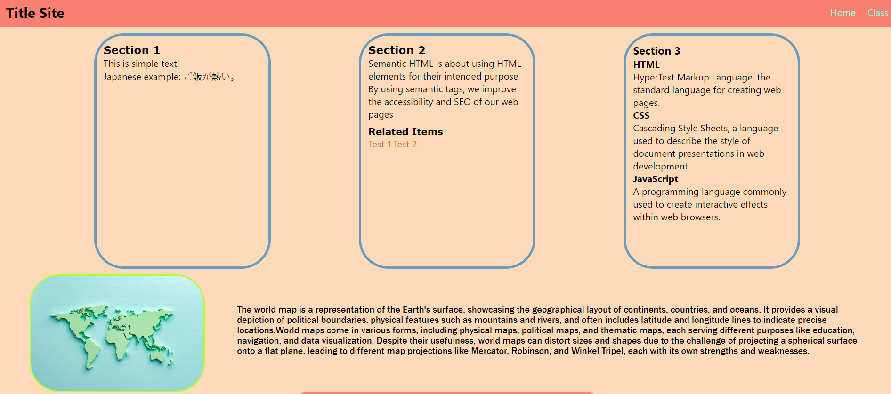
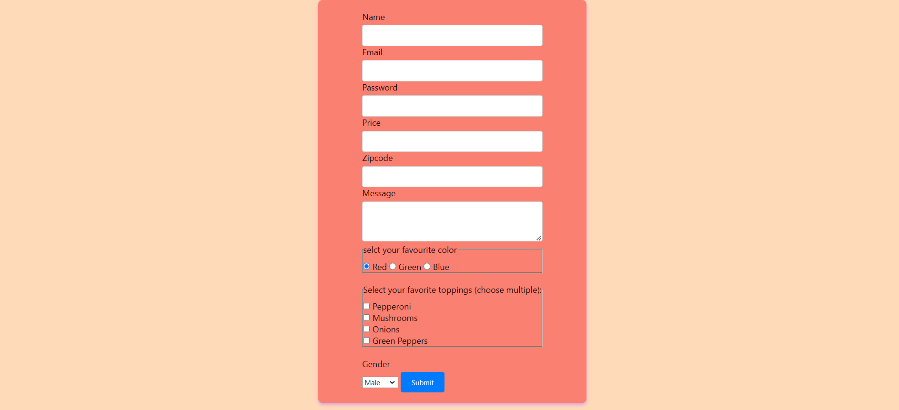
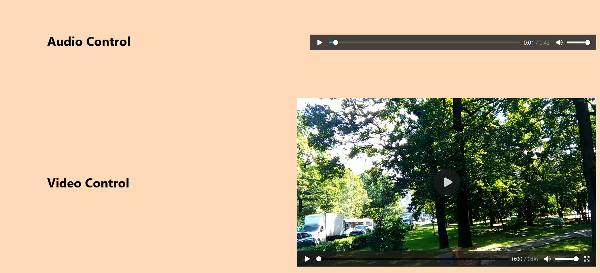
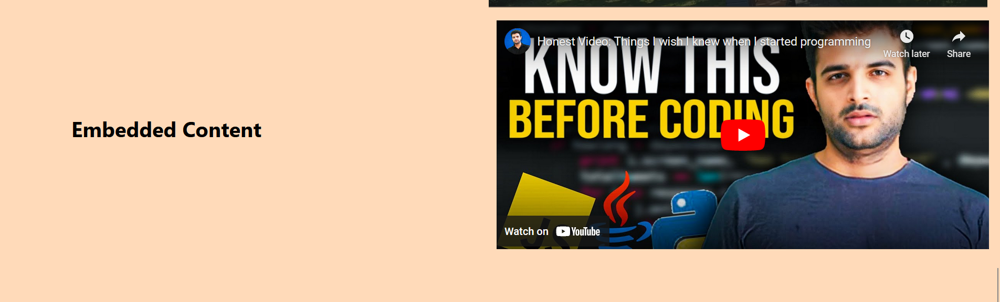
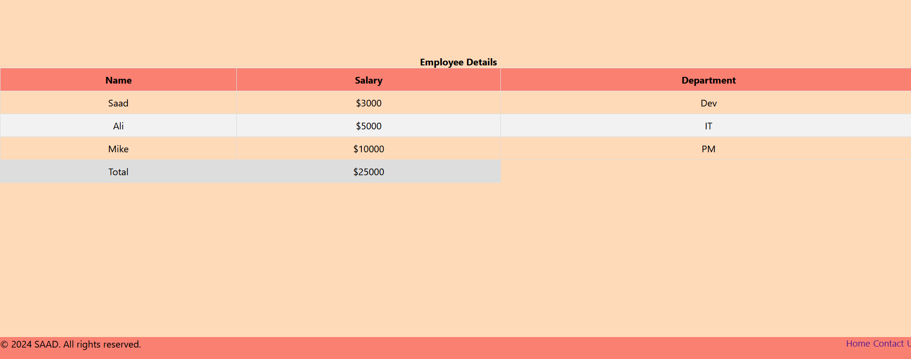

# HTML and CSS Basics

Welcome to the **HTML and CSS Basics** repository! This repository is designed to help you understand the fundamental concepts of HTML semantics and CSS layout techniques without relying on any CSS frameworks. 

## Table of Contents

- [Introduction](#introduction)
- [HTML Semantics](#html-semantics)
- [Media](#media)
  - [Pictures](#pictures)
  - [Audio](#audio)
  - [Video](#video)
  - [Embedded Content](#embedded-content)
- [Tables](#tables)
- [Forms](#forms)
  - [HTML5 Validation](#html5-validation)
- [CSS Layout](#css-layout)
  - [Grid](#grid)
  - [Flexbox](#flexbox)
  - [Box Model](#box-model)
- [Screenshots](#screenshots)
- [Getting Started](#getting-started)
- [Contributing](#contributing)
- [License](#license)

## Introduction

This repository aims to provide a comprehensive guide to understanding the essential elements of HTML and CSS. Whether you are a beginner or looking to brush up on your skills, you'll find useful examples and explanations here.

## HTML Semantics

Learn the importance of using semantic HTML elements for better accessibility and SEO.

- **Headers (h1-h6)**
- **Paragraphs (p)**
- **Sections (section, article, aside, nav)**
- **Divs and Spans (div, span)**

## Media

### Pictures

Understand how to use the `` tag, `srcset`, and `<picture>` for responsive images.

### Audio

Embed audio files using the `<audio>` tag with controls and various formats.

### Video

Learn to embed videos with the `<video>` tag, including controls, autoplay, and multiple sources.

### Embedded Content

Use the `<iframe>` tag to embed content from other sources like YouTube videos and Google Maps.

## Tables

Create and style tables using HTML `<table>`, `<tr>`, `<td>`, `<th>`, and other related tags.

## Forms

Build and style forms with various input types, labels, and fieldsets.

### HTML5 Validation

Implement HTML5 form validation features such as required fields, pattern matching, and input types.

## CSS Layout

### Grid

Design complex layouts with the CSS Grid layout system. Learn about grid containers, grid items, and grid properties.

### Flexbox

Use the Flexbox layout model to create flexible and responsive layouts. Understand flex containers, flex items, and various flex properties.

### Box Model

Understand the CSS Box Model, including margin, border, padding, and content.

## Screenshots

Here are some screenshots demonstrating various features covered in this repository:

*Navbar and Section with flexbox style*

*Forms Validation with Flexbox style*

*Audio and Video Control with Grid Style*

*Embeded Control with Grid Style*

*Navbar and footer with flex style*

## Getting Started

To get started with the examples in this repository:

1. Clone this repository: `git clone https://github.com/your-username/html-css-basics.git`
2. Navigate to the project directory: `cd html-css-basics`
3. Open the `index.html` file in your browser to view the examples.

## Contributing

Contributions are welcome! If you have any improvements or new examples, please submit a pull request.

1. Fork the repository
2. Create a new branch: `git checkout -b my-feature`
3. Make your changes and commit them: `git commit -m 'Add my feature'`
4. Push to the branch: `git push origin my-feature`
5. Submit a pull request

## License

This project is licensed under the MIT License - see the [LICENSE](LICENSE) file for details.
